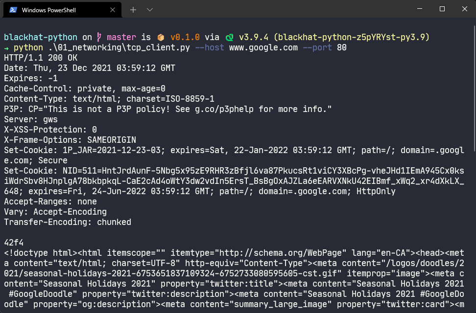
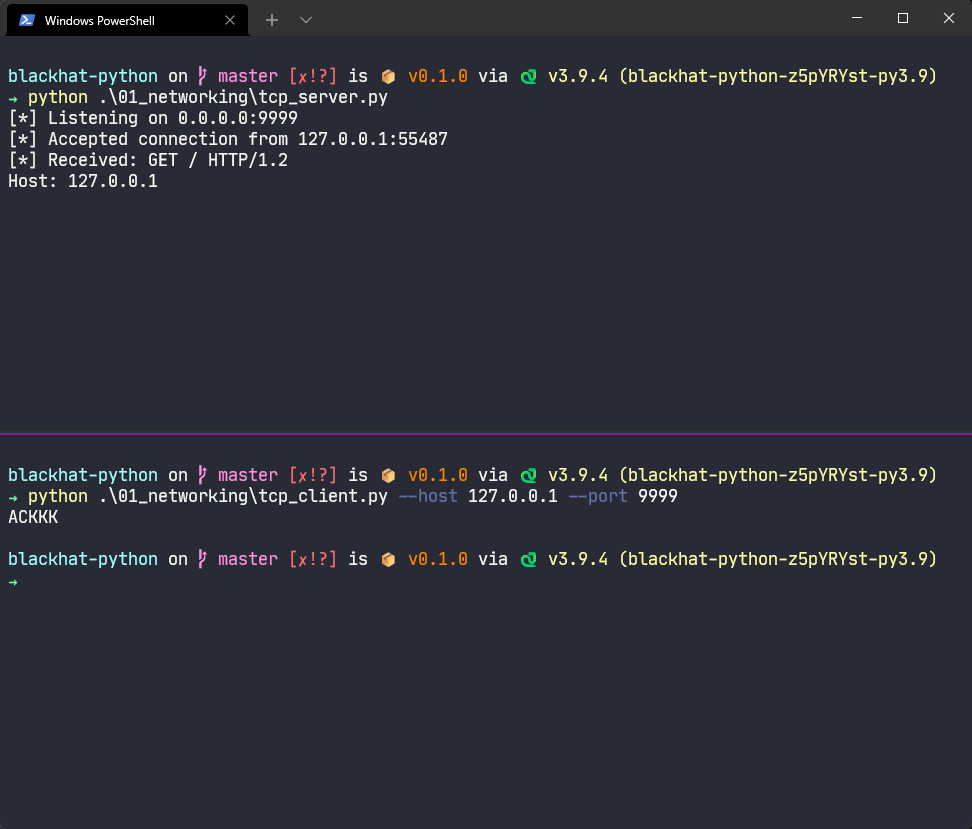
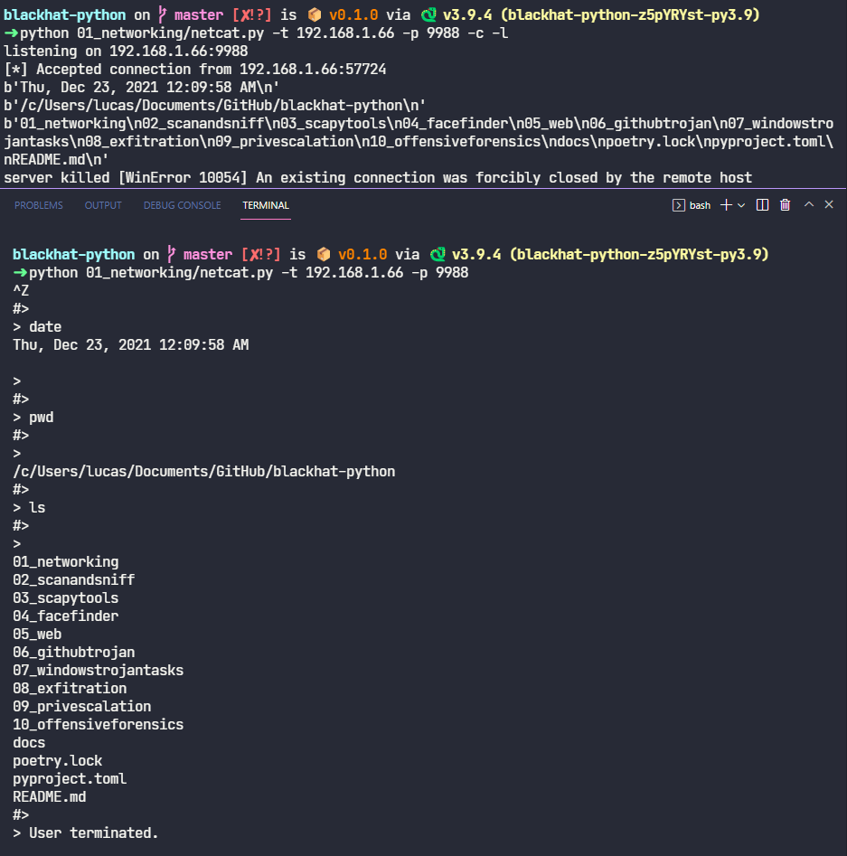

# Tools from Black Hat Python

[Black Hat Python, 2nd Edition
Python Programming for Hackers and Pentesters
by Justin Seitz and Tim Arnold](https://nostarch.com/black-hat-python2E)

Each tool is standalone, and any 3rd party libraries are described at the top of each file. To simplify installation, all 3rd party libraries for _all_ the tools in this repo can be installed with poetry using `poetry install`.

---
## Networking tools

### TCP Client


### TCP Server


### Netcat replacement

Can be used to upload files, execute remote commands (after pressing <kbd>Ctrl</kbd> + <kbd>Z</kbd>)

#### Examples

```bash
netcat.py -t 192.168.1.108 -p 5555 -l -c # command shell
netcat.py -t 192.168.1.108 -p 5555 -l -u=mytest.whatisup # upload to file
netcat.py -t 192.168.1.108 -p 5555 -l -e=\"cat /etc/passwd\" # execute command
echo 'ABCDEFGHI' | ./netcat.py -t 192.168.1.108 -p 135 # echo local text to server port 135
netcat.py -t 192.168.1.108 -p 5555 # connect to server
```

#### Screenshots

